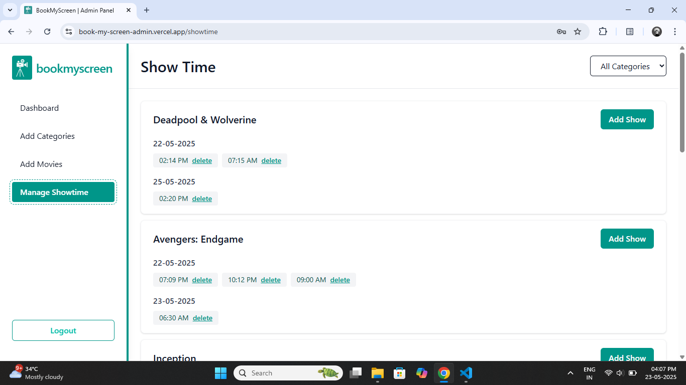

# Book My Screen Admin

Book My Screen Admin is a responsive dashboard to manage movies, showtimes, categories, and user bookings.

## 🔗 Live Preview

Check out the live version of the Admin Panel here:  
👉 [Book My Screen Admin Live](https://book-my-screen-admin.vercel.app/)

> 🔐 Login to access the dashboard  
> Email: `admin@gmail.com`  
> Password: `123567`

## 🧰 Tech Stack

This project is built using the following tools and libraries:

- **React JS** – For building the user interface

- **Redux Toolkit** – For managing and storing the app’s data

- **React Router** – For moving between pages

- **Firebase Realtime Database** – For saving movies, showtimes, and bookings

- **Tailwind CSS** – For fast and modern styling

- **Formik & Yup** – For building and validating forms easily

- **Custom Email/Password Login** – A simple manual system to log in as admin

## ✨ Features

Here’s what the admin can do in this panel:

- 🔐 **Secure Login** – Admins can log in only with a preset email and password.

- 🏠 **Dashboard Overview** – After login, admins can see how many tickets are booked and details of users who booked them:

  - Movie name

  - User name

  - User email

  - Showtime (date and time)


- 🎬 **Manage Movies** – Add, edit, or delete movies with detailed information:

  - Movie Name

  - Poster Image URL

  - Hero Section Image URL

  - Director Name

  - Category (select from existing categories)

  - Release Date

  - Language (e.g., English, Hindi)

  - IMDB Rating

  - Trailer Embed URL (YouTube)

  - Movie Description

- 🔎 **Filter Movies by Category** – Easily filter and view movies category-wise.

- 🕒 **Manage Showtimes** – For each movie, add or delete multiple showtimes with date and time.

- 🗂️ **Manage Categories** – Add, edit, or delete movie categories to organize movies better.

- 📱 **Responsive Design** – Mobile-friendly with toggle navbar on small screens and sidebar on desktop for smooth navigation.

## 🔥 Custom Admin Auth Without Firebase: Creating an onAuthStateChanged-Like System

When I started this project, I planned to make an admin login with Firebase Authentication. I wanted to create a system where new admins could register, but they could only log in after an existing admin approved their request. After that approval, they could log in as admins too.

But as I worked, I realized this was too much for the assignment. The assignment only needed a simple login and dashboard. So, I stopped adding the registration and approval system.

Then, I thought, if I use Firebase Authentication, it would be too much work for this simple login page where we only need a fixed email and password. So, I decided to make the login system using a basic if-else statement with a fixed email and password.

The problem came when I needed to handle login and logout. I could manually navigate users to different pages — after login, send them to the dashboard, and after logout, send them back to the landing page. Also, in the AuthLayout component, I could manage their state on page load. This was a simple and correct way.

But then I wondered how Firebase does this automatically. I searched online and, with the help of ChatGPT, I came up with an easy solution.

In my Authentication class, I created a `listeners` array to store functions (callbacks). Whenever a user logs in or logs out, I call all functions stored in this array to update the current user state (logged in or not).

This way, in the AuthLayout, I made my own custom `onAuthStateChanged` method, just like `Firebase’s`.

```js
class Authentication {
    constructor() {
        // Current user status from localStorage or null if not logged in
        this.user = JSON.parse(localStorage.getItem("token")) || null;
        // Array to store listener functions
        this.listeners = [];
    }

    login(email, password) {
        // After successful login, notify all listeners
        this.notifyListeners();
    }

    logout() {
        // After logout, notify all listeners
        this.notifyListeners();
    }

    onAuthStateChanged(callback) {
        // Add the callback function to the listeners array
        this.listeners.push(callback);
        // Immediately call the callback with current user status
        callback(this.user);

        // Return a function to remove this callback from listeners
        return () => {
            this.listeners = this.listeners.filter((listener) => listener !== callback);
        };
    }

    notifyListeners() {
        // Call every function in listeners with the current user state
        this.listeners.forEach((callback) => callback(this.user));
    }
}
```

## 🔥 Managing Nested Showtimes in Movies on Firebase Realtime Database

When I started building the admin dashboard, I created one `Admin class` to handle all Firebase database operations like `create`, `read`, `update`, and `delete`. This worked well for simple data like categories and movies because they are saved in the database in a simple, flat way.

For example, movies are saved like this:

```bash
/movies/movieId
```

and categories like this:

```bash
/categories/categoryId
```

This means each movie or category is saved directly under its own unique ID. It’s easy to update or delete them by using that ID.

But showtimes are different. Showtimes don’t have their own top-level path. Instead, showtimes are saved inside each movie as a nested object. Like this:

```json
"movies": {
  "abc123": {
    "title": "Inception",
    "showtime": {
      "2024-05-24": {
        "1716536936529": "12:30 PM"
      }
    }
  }
}
```

### My First Thought: Need for a Nested Update Function

I thought, since showtimes live deeply inside `/movies/{movieId}/showtime/...`, I couldn’t just use the regular `update(movieId, updatedData)` method. I believed a special nested update method was needed to precisely update those nested paths without messing up the rest of the movie data.

### What I Actually Did: Reusing the Existing Update Method

After digging deeper and experimenting, I realized I could reuse the existing update() method that updates the whole movie object, as long as I carefully prepare the updated showtimes object.

So instead of creating a new function, I handled nested updates by:

- Finding the current movie object from the local data.

- Making a `deep copy` of the movie’s existing showtimes.

- Adding/removing showtimes in that copy.

- Passing the updated showtimes object inside an `update()` call for the whole movie.

This way, the `update()` method gets the movie ID and the whole updated showtimes object, and Firebase replaces only the showtime part inside that movie.

Code Explanation Line-by-Line:
```js
const handleSubmit = async (values, actions) => {
    try {
        // 1. Find the movie we want to update
        const currentMovie = movies.find((m) => m.id === movie.id);
        if (!currentMovie) throw new Error("Movie not found");

        // 2. Format the date and time input from the form
        const formattedDate = formatDate(values.date);
        const formattedTime = formatTime(values.time);

        // 3. Deep copy current showtimes or start empty
        const updatedShowtime = JSON.parse(JSON.stringify(currentMovie.showtime || {}));

        // 4. If no showtimes for this date, create empty object
        if (!updatedShowtime[formattedDate]) {
            updatedShowtime[formattedDate] = {};
        } else {
            // 5. Check if this time is already booked on that date
            const timesOnDate = Object.values(updatedShowtime[formattedDate]);
            if (timesOnDate.includes(formattedTime)) {
                setError("Showtime already booked at this time on selected date.");
                return; // Stop if duplicate time
            }
        }

        // 6. Create a unique key for the showtime
        const timeKey = Date.now().toString();
        // 7. Add the new showtime under the date and unique key
        updatedShowtime[formattedDate][timeKey] = formattedTime;

        // 8. Update the movie with the new showtimes object in Firebase
        await MovieService.update(movie.id, { showtime: updatedShowtime });

        // 9. Update Redux store and close modal
        dispatch(moviesActions.updateMovie({ 
            id: movie.id, 
            updatedData: { showtime: updatedShowtime } 
        }));

        dispatch(uiActions.closeModal());

    } catch (error) {
        console.error("Failed to add showtime");
    } finally {
        actions.setSubmitting(false);
    }
};
```

## 📸 Preview



